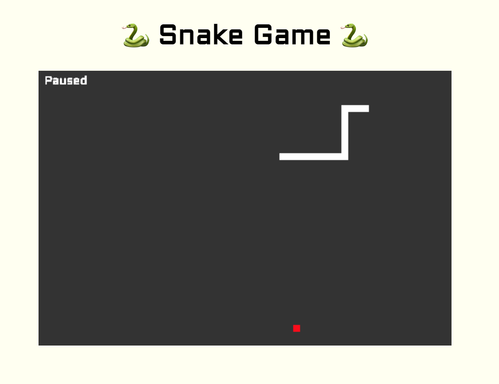

# Snake Game

The classic snake game written in Clojurescript using Shadow.cljs.

## Playing the Game

You can play the [game here](https://cheerful-eclair-0dcc03.netlify.app/).




## Run in Development Mode

My personal development setup is to use VSCode with Calva and `Start a Project REPL` choosing project-type `shadow-cljs` with the `:frontend` build. On the command line you can type:

```
npx shadow-cljs watch :frontend
```

## Run in Release Mode

```
npx shadow-cljs release :frontend
```
Then using an http server, e.g. [http-server](https://github.com/http-party/http-server), serve the public directory `public/`.

# Attributions

The favicon was generated using the following graphics from Twitter Twemoji:
- Graphics Author: Copyright 2020 Twitter, Inc and other contributors (https://github.com/twitter/twemoji)
- Graphics Source: https://github.com/twitter/twemoji/blob/master/assets/svg/1f40d.svg
- Graphics License: CC-BY 4.0 (https://creativecommons.org/licenses/by/4.0/)